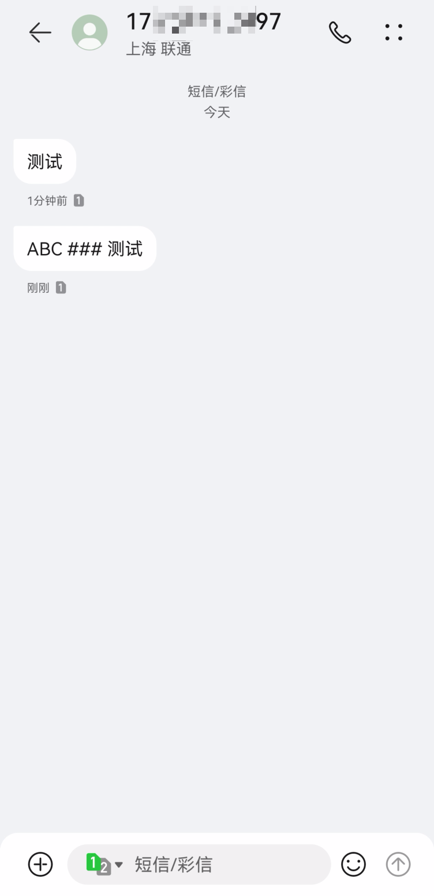

# smserialport

一个串口 SMS 库，可通过简单设置即可调用串口设备发送短信。

# 硬件

- A7680C 模块
- CH340 USB to TTL

# 使用

```typescript
import { SMSerialport, MainlandChinaAdapter } from "smserialport";

const smserialport = new SMSerialport(MainlandChinaAdapter)

smserialport.config({
  // 短信发送者
  sender: '17*******97',
  // 短信接收者
  receiver: '15*******97',
  // 短信内容
  message: 'ABC ### 测试'
})

smserialport.send({
  // 串口
  path: "COM9",
  baudRate: 115200,
  dataBits: 8,
  stopBits: 1,
  parity: "none",
})
```

接收短信


